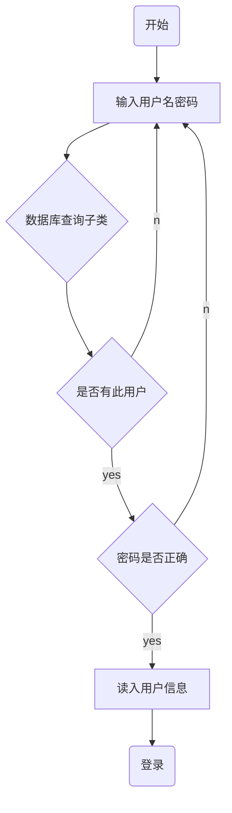
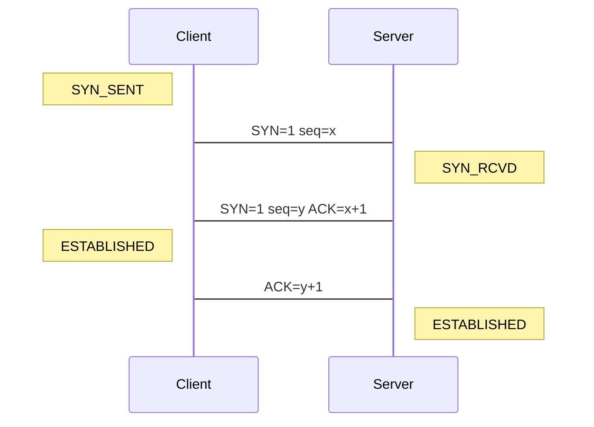

当我的博客文章越来越多的时候，所需要的图片也就越来越多。

这个时候就有两个很不爽的地方。

- 图片越多，打开的网页速度越慢
- 大量的图片占据了大量的空间

所以这个时候，我急需一个可以用文字表达的图片语法。

<!-- more -->

 

# 参考资料

 

[如何让你的HEXO博客支持手写流程图？](https://www.liuyude.com/How_to_make_your_HEXO_blog_support_handwriting_flowchart.html)

 

# 安装插件

 

首先，进入到博客的根目录，一定要在博客的根目录，很重要：

	cd your_blog

然后执行下面代码，用yarn来安装插件：

	yarn add hexo-filter-mermaid-diagrams

执行完成后在博客根目录下的node_modules种看下有没有hexo-filter-mermaid-diagrams这个插件文件夹，如果没有，说明没安装成功，安装成功后执行下一步，打开博客根目录下面的_config.yml文件，在底部插入以下代码：

	# mermaid chart
	mermaid: ## mermaid url https://github.com/knsv/mermaid
	  enable: true  # default true
	  version: "7.1.2" # default v7.1.2
	  options:  # find more api options from https://github.com/knsv/mermaid/blob/master/src/mermaidAPI.js
	    #startOnload: true  // default true

完成上一步操作之后打开主题目录的themes/next/layout/_partials/footer.swig，这里因为我用的是next主题，其他主题应该大同小异，在footer.swig文件最后加上以下代码：



  
  



上面的代码显示不全，因为里面涉及了一下 markdown 的渲染标示。所以，建议看一下我参考的资料。

在这里截一下这个图，我自己可以看一下 md 文件。

添加完成后，回到博客根目录的_config.yml，把external_link的值改为false，默认的为true，这一步绝大多数教程中都没有写。

这里需要着重说明下，下方我会放出作者的官方教程，但由于我之前一直没成功，所以我联系到了作者本人，上述代码加了之后的确也生效了，但这个跟其它博主的教程有不一样之处，如果上述代码加入后未生效，可尝试其它教程代码试试。

做完以上三步之后，应该已经生效了，赶紧hexo clean试试，然后用hexo g，hexo s试试看生效了没。

hexo g 是为了加载配置。

 

# 个性化背景颜色

 

因为，我之前设置代码一类的背景是黑色，导致，这个画图也是黑色，这样就难以分辨了。

所以，下面我将其设置为透明背景。

文件位置（next主题为例）

	themes\next\source\css\_custom\custom.styl

添加

	.mermaid {
	 background: transparent;
	}

我还设置了其他的样式

	.mermaid{
	  text-align: center;
	  max-height: 500px;
	}

 

# 语法

 

## 官方网址

[官方](https://mermaid-js.github.io/mermaid/#/)

因为渲染问题，导致下面的代码显示不一样，在这里截一下图。

## 流程图示例





## 时序图示例





