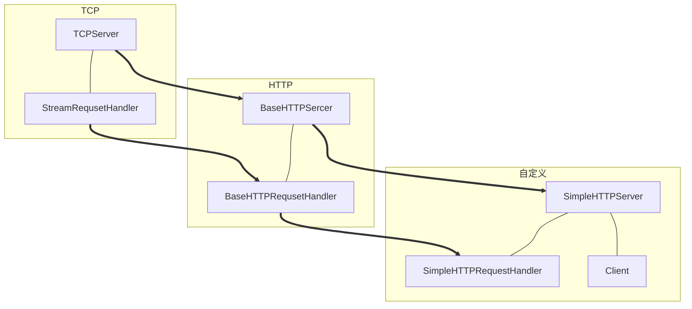
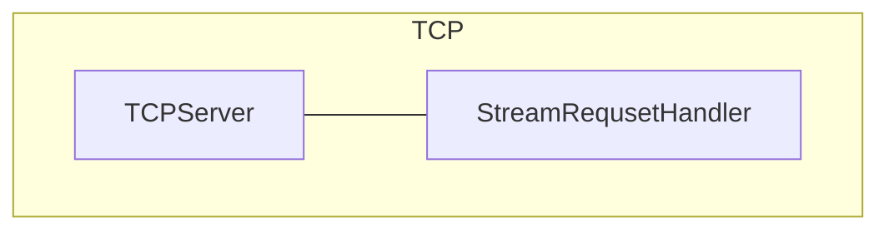
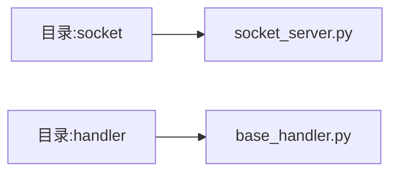
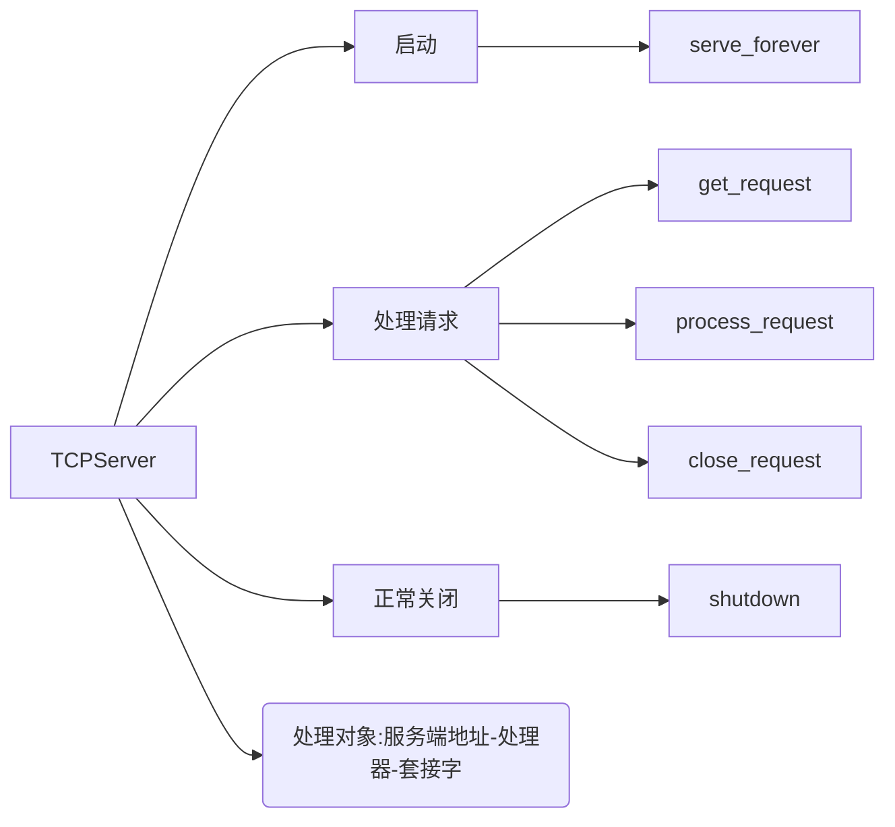
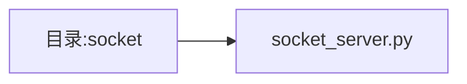
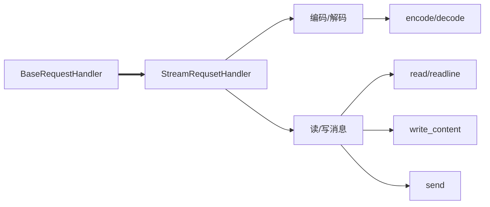
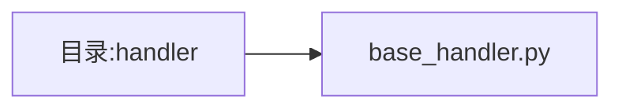

这一章节我们将实现 TCP 协议的套接字服务的编程，为后续应用层 HTTP 协议 做准备。

<!-- more -->

<br/>

# 技术路线

<br/>

画图是真的烂，我也是第一次用这个插件，见谅，2333～～～



在这里说明一下

- TCP 端
	- TCPServer ：接收客户端的 TCP 连接
	- StreamRequsetHandler ：封装字节流网络请求处理功能
- HTTP端
	- BaseHTTPSercer ：基础 HTTP 服务器
	- BaseHTTPRequsetHandler ：封装 HTTP 请求处理的基础功能
- 自定义
	- SimpleHTTPRequestHandler ：实现自定义的 HTTP 请求（GET、POST）处理逻辑

<br/>

# 本章完成的内容

<br/>

## 技术路线图



- TCP 端
	- TCPServer ：接收客户端的 TCP 连接
	- StreamRequsetHandler ：封装字节流网络请求处理功能

## 目录结构



- socket 是处理 TCPServer
- handler 是处理 StreamRequsetHandler

## 涉及的技术


- TCPServer
	- 需要 TCP 服务器的工作原理
- StreamRequsetHandler
	- 需要 TCP 连接处理的原理
- 多线程TCPServer
	- 需要服务端多线程处理请求模型

<br/>

# TCPServer

<br/>

后面那些都是方法



## socket_server.py



```python
# -*- encoding=utf-8 -*-

import socket
import threading

class TCPServer:

    def __init__(self, server_address, handler_class):
        self.server_address = server_address
        self.HandlerClass = handler_class
        self.socket = socket.socket(socket.AF_INET, socket.SOCK_STREAM)
        self.is_shutdown = False

    # 服务器的启动函数
    def serve_forever(self):
        self.socket.bind(self.server_address)
        self.socket.listen(10)
        # while True:
        while not self.is_shutdown:
            # 1. 接收请求
            request, client_address = self.get_request()
            # 2. 处理请求
            try:
                self.process_request(request, client_address)
            except Exception as e:
                print(e)

    # 接收请求
    def get_request(self):
        return self.socket.accept()

    # 处理请求
    def process_request(self, request, client_address):
        handler = self.HandlerClass(self, request, client_address)
        handler.handle()
        # 3. 关闭连接
        self.close_request(request)


    # 关闭请求
    def close_request(self, request):
        request.shutdown(socket.SHUT_WR)
        request.close()

    # 关闭服务器
    def shutdown(self):
        self.is_shutdown = True
```

<br/>

# StreamRequsetHandler

<br/>

- BaseRequestHandler
	- 定义连接处理的基本操作 & 相关属性
- StreamRequsetHandler
	- 主要作用是 封装 TCP 处理逻辑




## base_handler.py




```python
# -*- encoding=utf-8 -*-


class BaseRequestHandler:
    def __init__(self, server, request, client_address):
        self.server = server
        self.request = request
        self.client_address = client_address

    def handle(self):
        pass


class StreamRequestHandler(BaseRequestHandler):

    def __init__(self, server, request, client_address):
        BaseRequestHandler.__init__(self, server, request, client_address)

        self.rfile = self.request.makefile('rb')
        self.wfile = self.request.makefile('wb')
        self.wbuf = []

    # 编码：字符串->字节码
    def encode(self, msg):
        if not isinstance(msg, bytes):
            msg = bytes(msg, encoding='utf-8')
        return msg

    # 解码：字节码->字符串
    def decode(self, msg):
        if isinstance(msg, bytes):
            msg = msg.decode()
        return msg

    # 读消息
    def read(self, length):
        msg = self.rfile.read(length)
        return self.decode(msg)

    # 读取一行消息
    def readline(self, length=65536):
        msg = self.rfile.readline(length).strip()
        return self.decode(msg)

    # 写消息
    def write_content(self, msg):
        msg = self.encode(msg)
        self.wbuf.append(msg)

    # 发送消息
    def send(self):
        for line in self.wbuf:
            self.wfile.write(line)
        self.wfile.flush()
        self.wbuf = []

    def close(self):
        self.wfile.close()
        self.rfile.close()
```

