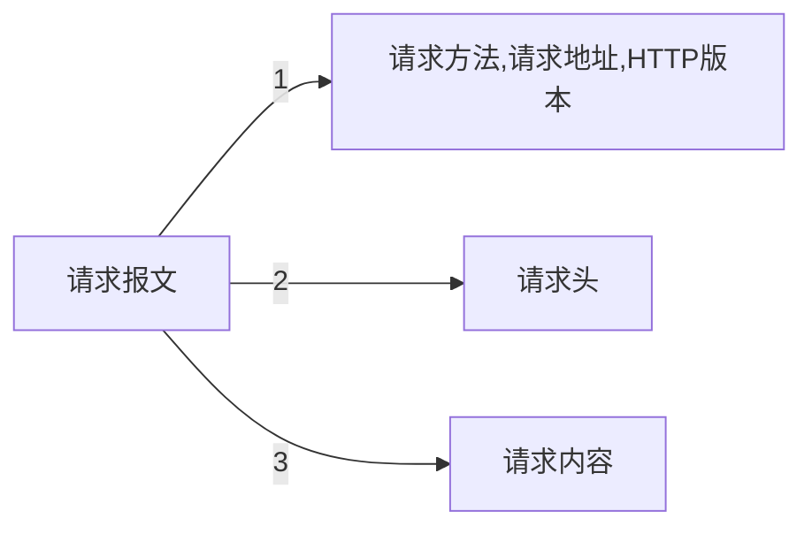
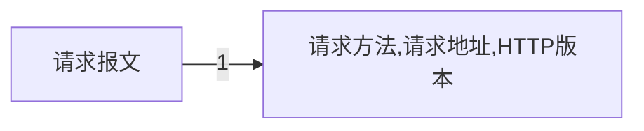
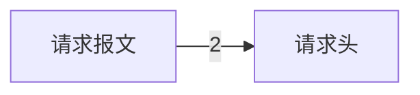
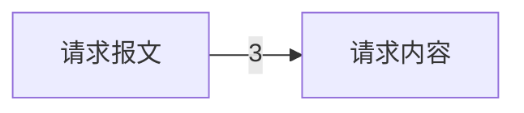
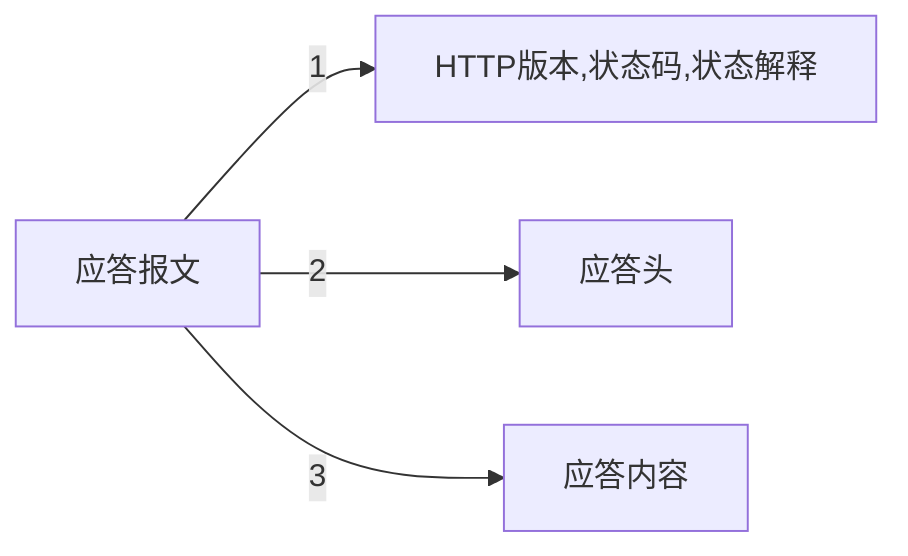

本章将讲述下面的知识.

- 了解 HTTP 协议
- 掌握 HTTP 请求报文的细节
- 掌握 HTTP 应答报文的细节

<!-- more -->

 

# 请求过程

 

 

# 请求报文详解

 

## 报文结构

## 请求行

- 请求方法,请求地址,HTTP版本

### 请求方法

GET、POST 等，在这里不再细说，你可以在我下面的博文中找到相关内容。

[编程规范 | rest 接口篇](https://benpaodewoniu.github.io/2020/03/03/standard0/)

### 请求地址

就是我们常见的 url

### HTTP版本

- HTTP/0.9
- HTTP/1.0
- HTTP/1.1

ps:请求行的三个内容是通过空格相互分割的

## 请求头

- 通信的附加信息（比如：是手机还是浏览器等）
- 形式： key : value

### 例子

|key|value|
|---|---|
|Accept|text/html、image/png、application/xml|
|Accept-Encoding|gzip、deflate、br|
|Accept-Language|zh-CN;q=0.9,en;|
|Host|coding.google.com|
|User-Agent|Chrome/75.0.3770.100 Safari/537.36|
|Cache-Control|max-age=0|

## 请求内容

- 发送数据
- 请求内容不是必须的，格式没要求，主要是和服务器协商好，比如下面
	- { 'username':'test','password':'123'}

ps：请求头和请求内容之间是有一个空行的

 

# 应答报文

 

## 报文结构

## 状态行

- 状态码
- 状态解释

请看我下面的博文

[编程规范 | rest 接口篇](https://benpaodewoniu.github.io/2020/03/03/standard0/)

## 应答头

将应答头和请求头统称为消息头。

|消息头|说明|
|---|---|
|一般头|适用于请求和响应|
|请求头|仅限于请求使用|
|应答头|仅限于应答使用|
|实体头|适用于请求和响应|

 

应答头 部分展示

|key|value|
|---|---|
|Server|Nginx|
|Content-Encoding|gzio,deflate,br|
|Content-Language|zh-CN,zh;q=0.9|
|Date|Sun, 25 Aug 2019 09:20;43 GMT|
|Content-Length|666|
|Access-Control-Allow-Origin|*|