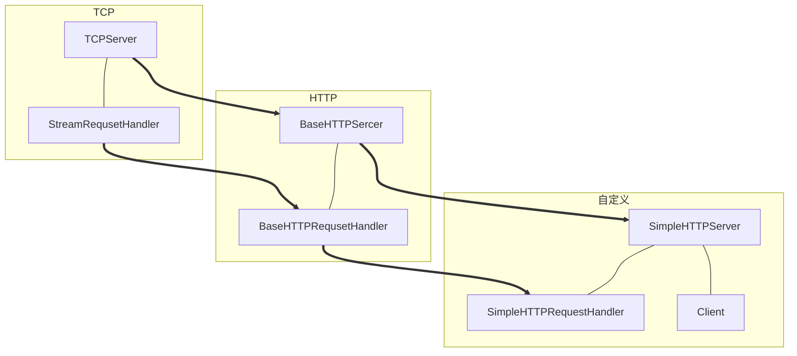
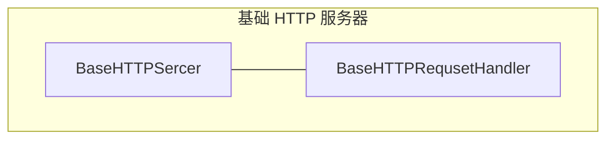
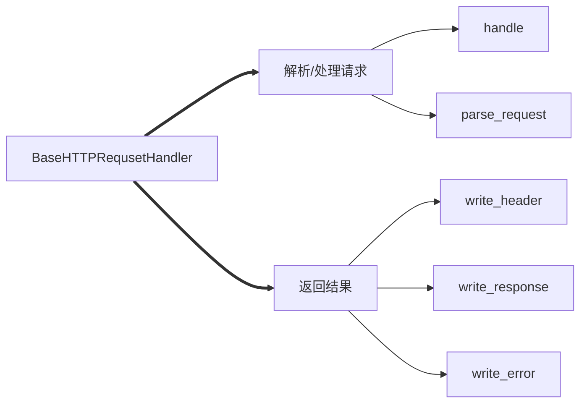

这一章节，我们将结合之前的工作，实现一个基础的 http 请求处理器。

<!-- more -->

<br/>

# 总路线图

<br/>



<br/>

# 本节目录

<br/>

目前，我们的目录结构如下

- http
	- handler
		- \_\_init\_\_.py
		- base_handler.py
		- base_http_handler.py
	- server
		- socket_server.py
		- base_http_server.py
	- test
		- test.py
	util.py

<br/>

# 本章路线图

<br/>



- 封装 HTTP 请求处理的基础功能

<br/>

# BaseHTTPRequsetHandler

<br/>



根据前面学习的知识

[http | 自己实现一个 http 服务器 NO:3](https://benpaodewoniu.github.io/2020/03/19/http2/)

我们知道下面的信息，对于一个请求报文来说

- 请求头只占一行
- 请求头是多行，以空行结束
- 请求内容可以为空

## base_http_handler.py

```python
# -*- encoding=utf-8 -*-


import logging

from util import date_time_string
from handler.base_handler import StreamRequestHandler

logging.basicConfig(level=logging.DEBUG,
                    format='%(asctime)s - %(filename)s[line:%(lineno)d] - %(levelname)s: %(message)s')


class BaseHTTPRequestHandler(StreamRequestHandler):

    def __init__(self, server, request, client_address):
        self.request_line = None
        self.method = None
        self.path = None
        self.version = None
        self.headers = None
        self.body = None
        StreamRequestHandler.__init__(self, server, request, client_address)

    # 请求的处理
    def handle(self):
        try:
            # 1. 解析请求
            if not self.parse_request():
                return
            # 2. 方法执行(GET、POST)
            method_name = 'do_' + self.method
            # 自检判断方法是否存在
            if not hasattr(self, method_name):
                self.write_error(404, None)
                self.send()
                return
            method = getattr(self, method_name)
            method()  # 应答报文的封装
            # 3. 发送结果
            self.send()
        except Exception as e:
            logging.exception(e)

    def do_GET(self):
        msg = '<h1>Hello World</h1>'
        self.write_response(200, 'Success')
        self.write_header('Content-Length', len(msg))
        self.end_headers()
        self.write_content(msg)

    # 解析请求头
    def parse_headers(self):
        headers = {}
        while True:
            line = self.readline()
            # 如果是空行，表示请求头已经结束
            if line:
                key, value = line.split(":", 1)
                key = key.strip()
                value = value.strip()
                headers[key] = value
            else:
                break
        return headers

    # 解析请求
    def parse_request(self):
        # 1. 解析请求行
        first_line = self.readline()
        self.request_line = first_line
        if not self.request_line:
            return
        words = first_line.split()
        # 请求方法、请求的地址、请求的HTTP版本
        self.method, self.path, self.version = words
        # 2. 解析请求头
        self.headers = self.parse_headers()

        # 3. 解析请求内容
        key = 'Content-Length'
        if key in self.headers.keys():
            # 请求内容的长度
            body_length = int(self.headers[key])
            self.body = self.read(body_length)

        return True

    # 写入应答头
    def write_header(self, key, value):
        msg = '%s: %s\r\n' % (key, value)
        self.write_content(msg)

    default_http_version = 'HTTP/1.1'

    # 写入正常HTTP应答的头部
    def write_response(self, code, msg=None):
        logging.info("%s, code: %s." % (self.request_line, code))
        if msg == None:
            msg = self.responses[code][0]
        # 状态行
        response_line = '%s %d %s\r\n' % (self.default_http_version, code, msg)
        self.write_content(response_line)
        # 应答头
        self.write_header('Server',
                          '%s: %s' % (self.server.server_name, self.server.version))
        self.write_header('Date', date_time_string())
        pass

    DEFAULT_ERROR_MESSAGE_TEMPLATE = r'''
    <head>
    <title>Error response</title>
    </head>
    <body>
    <h1>Error response</h1>
    <p>Error code %(code)d.
    <p>Message: %(message)s.
    <p>Error code explanation: %(code)s = %(explain)s.
    </body>
    '''

    responses = {
        100: ('Continue', 'Request received, please continue'),
        101: ('Switching Protocols',
              'Switching to new protocol; obey Upgrade header'),

        200: ('OK', 'Request fulfilled, document follows'),
        201: ('Created', 'Document created, URL follows'),
        202: ('Accepted',
              'Request accepted, processing continues off-line'),
        203: ('Non-Authoritative Information', 'Request fulfilled from cache'),
        204: ('No Content', 'Request fulfilled, nothing follows'),
        205: ('Reset Content', 'Clear input form for further input.'),
        206: ('Partial Content', 'Partial content follows.'),

        300: ('Multiple Choices',
              'Object has several resources -- see URI list'),
        301: ('Moved Permanently', 'Object moved permanently -- see URI list'),
        302: ('Found', 'Object moved temporarily -- see URI list'),
        303: ('See Other', 'Object moved -- see Method and URL list'),
        304: ('Not Modified',
              'Document has not changed since given time'),
        305: ('Use Proxy',
              'You must use proxy specified in Location to access this '
              'resource.'),
        307: ('Temporary Redirect',
              'Object moved temporarily -- see URI list'),

        400: ('Bad Request',
              'Bad request syntax or unsupported method'),
        401: ('Unauthorized',
              'No permission -- see authorization schemes'),
        402: ('Payment Required',
              'No payment -- see charging schemes'),
        403: ('Forbidden',
              'Request forbidden -- authorization will not help'),
        404: ('Not Found', 'Nothing matches the given URI'),
        405: ('Method Not Allowed',
              'Specified method is invalid for this resource.'),
        406: ('Not Acceptable', 'URI not available in preferred format.'),
        407: ('Proxy Authentication Required', 'You must authenticate with '
                                               'this proxy before proceeding.'),
        408: ('Request Timeout', 'Request timed out; try again later.'),
        409: ('Conflict', 'Request conflict.'),
        410: ('Gone',
              'URI no longer exists and has been permanently removed.'),
        411: ('Length Required', 'Client must specify Content-Length.'),
        412: ('Precondition Failed', 'Precondition in headers is false.'),
        413: ('Request Entity Too Large', 'Entity is too large.'),
        414: ('Request-URI Too Long', 'URI is too long.'),
        415: ('Unsupported Media Type', 'Entity body in unsupported format.'),
        416: ('Requested Range Not Satisfiable',
              'Cannot satisfy request range.'),
        417: ('Expectation Failed',
              'Expect condition could not be satisfied.'),

        500: ('Internal Server Error', 'Server got itself in trouble'),
        501: ('Not Implemented',
              'Server does not support this operation'),
        502: ('Bad Gateway', 'Invalid responses from another server/proxy.'),
        503: ('Service Unavailable',
              'The server cannot process the request due to a high load'),
        504: ('Gateway Timeout',
              'The gateway server did not receive a timely response'),
        505: ('HTTP Version Not Supported', 'Cannot fulfill request.'),
    }

    # 写入错误HTTP请求的结果
    def write_error(self, code, msg=None):
        s_msg, l_msg = self.responses[code]
        if msg:
            s_msg = msg
        # 错误的HTML信息
        response_content = self.DEFAULT_ERROR_MESSAGE_TEMPLATE % {
            'code': code,
            'message': s_msg,
            'explain': l_msg
        }
        self.write_response(code, s_msg)
        # 请求头-应答内容之间：空行
        self.end_headers()
        self.write_content(response_content)

    # 结束应答头
    def end_headers(self):
        self.write_content('\r\n')

```

<br/>

# 编写测试用例

<br/>

如果要编写测试用例，我们需要在 server 里面创建一个新的 http 服务器。

## base_http_handler.py

```python
from server.socket_server import TCPServer


class BaseHTTPServer(TCPServer):

    def __init__(self, server_address, handler_class):
        self.server_name = 'BaseHTTPServer'
        self.version = 'v0.1'
        TCPServer.__init__(self, server_address, handler_class)
```

## test.py

```python
from server.base_http_server import BaseHTTPServer
from handler.base_http_handler import BaseHTTPRequestHandler

class BaseHTTPRequestHandlerTest:
    def run_server(self):
        BaseHTTPServer(('127.0.0.1', 9999), BaseHTTPRequestHandler).serve_forever()

    def run(self):
        self.run_server()

if __name__ == '__main__':
    BaseHTTPRequestHandlerTest().run()
```

## util.py

这里面放置的是返回时间的方法，也需要添加

```python
import sys
import time

weekdayname = ['Mon', 'Tue', 'Wed', 'Thu', 'Fri', 'Sat', 'Sun']

monthname = [None,
             'Jan', 'Feb', 'Mar', 'Apr', 'May', 'Jun',
             'Jul', 'Aug', 'Sep', 'Oct', 'Nov', 'Dec']


def date_time_string(timestamp=None):
    if timestamp is None:
        timestamp = time.time()
    year, month, day, hh, mm, ss, wd, y, z = time.localtime(timestamp)
    s = "%s, %02d %3s %4d %02d:%02d:%02d" % (
        weekdayname[wd],
        day, monthname[month], year,
        hh, mm, ss)
    return s
```

运行 test.py 后，我们在浏览器访问 127.0.0.1:9999 会返回 Hello World