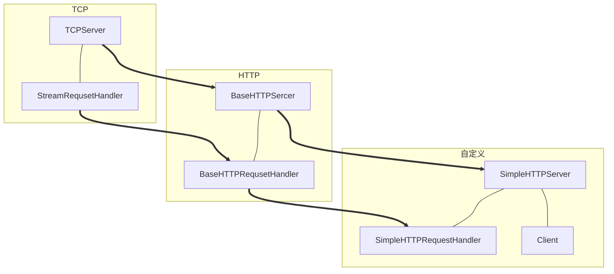

这个将所有代码都放上来，给大家提供一个合集。

<!-- more -->

<br/>

# 技术路线

<br/>



在这里说明一下

- TCP 端
	- TCPServer ：接收客户端的 TCP 连接
	- StreamRequsetHandler ：封装字节流网络请求处理功能
- HTTP端
	- BaseHTTPSercer ：基础 HTTP 服务器
	- BaseHTTPRequsetHandler ：封装 HTTP 请求处理的基础功能
- 自定义
	- SimpleHTTPRequestHandler ：实现自定义的 HTTP 请求（GET、POST）处理逻辑

<br/>

# 图片说明图

<br/>


<br/>

# 目录结构

<br/>

- http
    - handler
        - \_\_init\_\_.py
        - base_handler.py
        - base_http_handler.py
        - simple_http_handler.py
    - resources
    	- index.html
    - server
    	- base_http_server.py
    	- simple_http_server.py
        - socket_server.py
    - test
        - test.py
    - util.py

<br/>

# handler

<br/>

## base_handler.py

```python
# -*- encoding=utf-8 -*-


class BaseRequestHandler:
    def __init__(self, server, request, client_address):
        self.server = server
        self.request = request
        self.client_address = client_address

    def handle(self):
        pass


class StreamRequestHandler(BaseRequestHandler):

    def __init__(self, server, request, client_address):
        BaseRequestHandler.__init__(self, server, request, client_address)

        self.rfile = self.request.makefile('rb')
        self.wfile = self.request.makefile('wb')
        self.wbuf = []

    # 编码：字符串->字节码
    def encode(self, msg):
        if not isinstance(msg, bytes):
            msg = bytes(msg, encoding='utf-8')
        return msg

    # 解码：字节码->字符串
    def decode(self, msg):
        if isinstance(msg, bytes):
            msg = msg.decode()
        return msg

    # 读消息
    def read(self, length):
        msg = self.rfile.read(length)
        return self.decode(msg)

    # 读取一行消息
    def readline(self, length=65536):
        msg = self.rfile.readline(length).strip()
        return self.decode(msg)

    # 写消息
    def write_content(self, msg):
        msg = self.encode(msg)
        self.wbuf.append(msg)

    # 发送消息
    def send(self):
        for line in self.wbuf:
            self.wfile.write(line)
        self.wfile.flush()
        self.wbuf = []

    def close(self):
        self.wfile.close()
        self.rfile.close()
```

## base_http_handler.py

```python
# -*- encoding=utf-8 -*-


import logging

from util import date_time_string
from handler.base_handler import StreamRequestHandler

logging.basicConfig(level=logging.DEBUG,
                    format='%(asctime)s - %(filename)s[line:%(lineno)d] - %(levelname)s: %(message)s')


class BaseHTTPRequestHandler(StreamRequestHandler):

    def __init__(self, server, request, client_address):
        self.request_line = None
        self.method = None
        self.path = None
        self.version = None
        self.headers = None
        self.body = None
        StreamRequestHandler.__init__(self, server, request, client_address)

    # 请求的处理
    def handle(self):
        try:
            # 1. 解析请求
            if not self.parse_request():
                return
            # 2. 方法执行(GET、POST)
            method_name = 'do_' + self.method
            # 自检判断方法是否存在
            if not hasattr(self, method_name):
                self.write_error(404, None)
                self.send()
                return
            method = getattr(self, method_name)
            method()  # 应答报文的封装
            # 3. 发送结果
            self.send()
        except Exception as e:
            logging.exception(e)

    def do_GET(self):
        msg = '<h1>Hello World</h1>'
        self.write_response(200, 'Success')
        self.write_header('Content-Length', len(msg))
        self.end_headers()
        self.write_content(msg)

    # 解析请求头
    def parse_headers(self):
        headers = {}
        while True:
            line = self.readline()
            # 如果是空行，表示请求头已经结束
            if line:
                key, value = line.split(":", 1)
                key = key.strip()
                value = value.strip()
                headers[key] = value
            else:
                break
        return headers

    # 解析请求
    def parse_request(self):
        # 1. 解析请求行
        first_line = self.readline()
        self.request_line = first_line
        if not self.request_line:
            return
        words = first_line.split()
        # 请求方法、请求的地址、请求的HTTP版本
        self.method, self.path, self.version = words
        # 2. 解析请求头
        self.headers = self.parse_headers()

        # 3. 解析请求内容
        key = 'Content-Length'
        if key in self.headers.keys():
            # 请求内容的长度
            body_length = int(self.headers[key])
            self.body = self.read(body_length)

        return True

    # 写入应答头
    def write_header(self, key, value):
        msg = '%s: %s\r\n' % (key, value)
        self.write_content(msg)

    default_http_version = 'HTTP/1.1'

    # 写入正常HTTP应答的头部
    def write_response(self, code, msg=None):
        logging.info("%s, code: %s." % (self.request_line, code))
        if msg == None:
            msg = self.responses[code][0]
        # 状态行
        response_line = '%s %d %s\r\n' % (self.default_http_version, code, msg)
        self.write_content(response_line)
        # 应答头
        self.write_header('Server',
                          '%s: %s' % (self.server.server_name, self.server.version))
        self.write_header('Date', date_time_string())
        pass

    DEFAULT_ERROR_MESSAGE_TEMPLATE = r'''
    <head>
    <title>Error response</title>
    </head>
    <body>
    <h1>Error response</h1>
    <p>Error code %(code)d.
    <p>Message: %(message)s.
    <p>Error code explanation: %(code)s = %(explain)s.
    </body>
    '''

    responses = {
        100: ('Continue', 'Request received, please continue'),
        101: ('Switching Protocols',
              'Switching to new protocol; obey Upgrade header'),

        200: ('OK', 'Request fulfilled, document follows'),
        201: ('Created', 'Document created, URL follows'),
        202: ('Accepted',
              'Request accepted, processing continues off-line'),
        203: ('Non-Authoritative Information', 'Request fulfilled from cache'),
        204: ('No Content', 'Request fulfilled, nothing follows'),
        205: ('Reset Content', 'Clear input form for further input.'),
        206: ('Partial Content', 'Partial content follows.'),

        300: ('Multiple Choices',
              'Object has several resources -- see URI list'),
        301: ('Moved Permanently', 'Object moved permanently -- see URI list'),
        302: ('Found', 'Object moved temporarily -- see URI list'),
        303: ('See Other', 'Object moved -- see Method and URL list'),
        304: ('Not Modified',
              'Document has not changed since given time'),
        305: ('Use Proxy',
              'You must use proxy specified in Location to access this '
              'resource.'),
        307: ('Temporary Redirect',
              'Object moved temporarily -- see URI list'),

        400: ('Bad Request',
              'Bad request syntax or unsupported method'),
        401: ('Unauthorized',
              'No permission -- see authorization schemes'),
        402: ('Payment Required',
              'No payment -- see charging schemes'),
        403: ('Forbidden',
              'Request forbidden -- authorization will not help'),
        404: ('Not Found', 'Nothing matches the given URI'),
        405: ('Method Not Allowed',
              'Specified method is invalid for this resource.'),
        406: ('Not Acceptable', 'URI not available in preferred format.'),
        407: ('Proxy Authentication Required', 'You must authenticate with '
                                               'this proxy before proceeding.'),
        408: ('Request Timeout', 'Request timed out; try again later.'),
        409: ('Conflict', 'Request conflict.'),
        410: ('Gone',
              'URI no longer exists and has been permanently removed.'),
        411: ('Length Required', 'Client must specify Content-Length.'),
        412: ('Precondition Failed', 'Precondition in headers is false.'),
        413: ('Request Entity Too Large', 'Entity is too large.'),
        414: ('Request-URI Too Long', 'URI is too long.'),
        415: ('Unsupported Media Type', 'Entity body in unsupported format.'),
        416: ('Requested Range Not Satisfiable',
              'Cannot satisfy request range.'),
        417: ('Expectation Failed',
              'Expect condition could not be satisfied.'),

        500: ('Internal Server Error', 'Server got itself in trouble'),
        501: ('Not Implemented',
              'Server does not support this operation'),
        502: ('Bad Gateway', 'Invalid responses from another server/proxy.'),
        503: ('Service Unavailable',
              'The server cannot process the request due to a high load'),
        504: ('Gateway Timeout',
              'The gateway server did not receive a timely response'),
        505: ('HTTP Version Not Supported', 'Cannot fulfill request.'),
    }

    # 写入错误HTTP请求的结果
    def write_error(self, code, msg=None):
        s_msg, l_msg = self.responses[code]
        if msg:
            s_msg = msg
        # 错误的HTML信息
        response_content = self.DEFAULT_ERROR_MESSAGE_TEMPLATE % {
            'code': code,
            'message': s_msg,
            'explain': l_msg
        }
        self.write_response(code, s_msg)
        # 请求头-应答内容之间：空行
        self.end_headers()
        self.write_content(response_content)

    # 结束应答头
    def end_headers(self):
        self.write_content('\r\n')
```

## simple_http_handler.py

```python
# -*- encoding=utf-8 -*-


import os
import json
from urllib import parse

from handler.base_http_handler import BaseHTTPRequestHandler


RESOURCES_PATH = os.path.join(os.path.abspath(os.path.dirname(__name__)),
                              '../resources')


class SimpleHTTPRequestHandler(BaseHTTPRequestHandler):

    def __init__(self, server, request, client_address):
        BaseHTTPRequestHandler.__init__(self, server, request, client_address)

    def do_GET(self):
        found, resource_path = self.get_resources(self.path)
        if not found:
            self.write_error(404)
            self.send()
        else:
            with open(resource_path, 'rb') as f:
                fs = os.fstat(f.fileno())
                # 文件的长度
                clength = str(fs[6])
                self.write_response(200)
                self.write_header('Content-Length', clength)
                # 避免跨域问题
                self.write_header('Access-Control-Allow-Origin', 'http://%s:%d' %
                                  (self.server.server_address[0], self.server.server_address[1]))
                self.end_headers()
                while True:
                    buf = f.read(1024)
                    if not buf:
                        break
                    self.write_content(buf)
                # self.send()

    def do_POST(self):
        # 从请求取出数据
        body = json.loads(self.body)
        print(body)
        username = body['username']
        password = body['password']
        # 数据校验
        if username == 'dongdongqiang' and password == '123456':
            response = {'message': 'success', 'code': 0}
        else:
            response = {'message': 'failed', 'code': -1}
        response = json.dumps(response)
        # 组成应答报文
        self.write_response(200)
        self.write_header('Content-Length', len(response))
        self.write_header('Access-Control-Allow-Origin', 'http://%s:%d' %
                          (self.server.server_address[0], self.server.server_address[1]))
        self.end_headers()
        self.write_content(response)

    # 判断并获取资源
    def get_resources(self, path):
        url_result = parse.urlparse(path)
        resource_path = str(url_result[2])
        if resource_path.startswith('/'):
            resource_path = resource_path[1:]
        resource_path = os.path.join(RESOURCES_PATH, resource_path)
        if os.path.exists(resource_path) and os.path.isfile(resource_path):
            return True, resource_path
        else:
            return False, resource_path
```

<br/>

# resources

<br/>

## index.html

```html
<!DOCTYPE html>
<html lang="en">

<head>
    <meta charset="UTF-8">
    <title>实现HTTP服务器</title>
    <!-- 最新版本的 Bootstrap 核心 CSS 文件 -->
    <link rel="stylesheet" href="https://cdn.jsdelivr.net/npm/bootstrap@3.3.7/dist/css/bootstrap.min.css"
          integrity="sha384-BVYiiSIFeK1dGmJRAkycuHAHRg32OmUcww7on3RYdg4Va+PmSTsz/K68vbdEjh4u" crossorigin="anonymous">
    <script src="https://cdn.bootcss.com/jquery/3.4.1/jquery.min.js"></script>
    <!-- 最新的 Bootstrap 核心 JavaScript 文件 -->
    <script src="https://cdn.jsdelivr.net/npm/bootstrap@3.3.7/dist/js/bootstrap.min.js"
            integrity="sha384-Tc5IQib027qvyjSMfHjOMaLkfuWVxZxUPnCJA7l2mCWNIpG9mGCD8wGNIcPD7Txa"
            crossorigin="anonymous"></script>

</head>

<body>
<div class="container">
    <div class="page-header">
        <h1>从0到1实现HTTP服务器
            <button type="submit" style="float:right" class="btn btn-default btn-lg" data-toggle="modal"
                    data-target="#loginModal">
                Login
            </button>
        </h1>
    </div>
    <!-- Button trigger modal -->


    <!-- Modal -->
    <div class="modal fade" id="loginModal" tabindex="-1" role="dialog" aria-labelledby="loginModalLabel">
        <div class="modal-dialog" role="document">
            <div class="modal-content">
                <div class="modal-header">
                    <button type="button" class="close" data-dismiss="modal" aria-label="Close"><span
                            aria-hidden="true">&times;</span></button>
                    <h4 class="modal-title" id="loginModalLabel">Modal title</h4>
                </div>
                <div class="modal-body">
                    <form id="login">
                        <div class="form-group">
                            <label for="inputUsername">Username</label>
                            <input class="form-control" id="inputUsername" placeholder="Username">
                        </div>
                        <div class="form-group">
                            <label for="inputPassword">Password</label>
                            <input type="password" class="form-control" id="inputPassword" placeholder="Password">
                        </div>
                    </form>
                </div>
                <div class="modal-footer">
                    <button type="button" class="btn btn-default" data-dismiss="modal">Close</button>
                    <button type="button" class="btn btn-primary" onclick="submitData()">Submit</button>
                </div>
            </div>
        </div>
    </div>
</div>
</body>
<script>
    function submitData() {
        var username = $("#inputUsername").val();
        var password = $("#inputPassword").val();
        if (username.length == 0 || password.length == 0) {
            alert("账户或密码为空！")
        } else {
            $.ajax({
                type: 'POST',
                url: 'http://localhost:8888/api/login',
                data: JSON.stringify({
                    "username": username,
                    "password": password
                }),
                dataType: 'json',
                success: function (data) {
                    if (data.message == 'success') {
                        $('#loginModal').modal('hide');
                        console.log('success');
                        window.location = "http://www.baidu.com";
                    } else {
                        alert('账号密码校验失败');
                    }
                }
            })
        }
    };

</script>

</html>
```

<br/>

# server

<br/>

## base_http_server.py

```python
from server.socket_server import TCPServer


class BaseHTTPServer(TCPServer):

    def __init__(self, server_address, handler_class):
        self.server_name = 'BaseHTTPServer'
        self.version = 'v0.1'
        TCPServer.__init__(self, server_address, handler_class)
```

## simple_http_server.py

```python

from server.base_http_server import BaseHTTPServer


class SimpleHTTPServer(BaseHTTPServer):

    def __init__(self, server_address, handler_class):
        self.server_name = 'SimpleHTTPServer'
        self.version = 'v0.1'
        BaseHTTPServer.__init__(self, server_address, handler_class)


if __name__ == '__main__':
    from handler.simple_http_handler import SimpleHTTPRequestHandler
    SimpleHTTPServer(('127.0.0.1', 8888), SimpleHTTPRequestHandler).serve_forever()
```

## socket_server.py

```python
# -*- encoding=utf-8 -*-

import socket
import threading

class TCPServer:

    def __init__(self, server_address, handler_class):
        self.server_address = server_address
        self.HandlerClass = handler_class
        self.socket = socket.socket(socket.AF_INET, socket.SOCK_STREAM)
        self.is_shutdown = False

    # 服务器的启动函数
    def serve_forever(self):
        self.socket.bind(self.server_address)
        self.socket.listen(10)
        # while True:
        while not self.is_shutdown:
            # 1. 接收请求
            request, client_address = self.get_request()
            # 2. 处理请求
            try:
                # self.process_request(request, client_address)
                self.process_request_multithread(request, client_address)
            except Exception as e:
                print(e)

    # 接收请求
    def get_request(self):
        return self.socket.accept()

    # 处理请求
    def process_request(self, request, client_address):
        handler = self.HandlerClass(self, request, client_address)
        handler.handle()
        # 3. 关闭连接
        self.close_request(request)

    # 多线程处理请求
    def process_request_multithread(self, request, client_address):
        t = threading.Thread(target=self.process_request,
                             args=(request, client_address))
        t.start()

    # 关闭请求
    def close_request(self, request):
        request.shutdown(socket.SHUT_WR)
        request.close()

    # 关闭服务器
    def shutdown(self):
        self.is_shutdown = True
```

<br/>

# test

<br/>

## test.py

```python
# -*- encoding=utf-8 -*-

import time
import socket
import threading

from server.socket_server import TCPServer
from handler.base_handler import StreamRequestHandler

from server.base_http_server import BaseHTTPServer
from handler.base_http_handler import BaseHTTPRequestHandler


class TestBaseRequestHandler(StreamRequestHandler):

    # 具体处理的逻辑(Echo)
    def handle(self):
        msg = self.readline()
        print('Server recv msg: ' + msg)
        time.sleep(1)
        self.write_content(msg)
        self.send()
        pass


# 测试SocketServer(TCPServer)
class SocketServerTest:
    def run_server(self):
        tcp_server = TCPServer(('127.0.0.1', 8888), TestBaseRequestHandler)
        tcp_server.serve_forever()

    # 客户端的具体连接逻辑
    def client_connect(self):
        client = socket.socket()
        client.connect(('127.0.0.1', 8888))
        client.send(b'Hello TCPServer\r\n')
        msg = client.recv(1024)
        print('Client recv msg: ' + msg.decode())

    # 生成客户端
    def gen_clients(self, num):
        clients = []
        for i in range(num):
            client_thread = threading.Thread(target=self.client_connect)
            clients.append(client_thread)
        return clients

    def run(self):
        server_thread = threading.Thread(target=self.run_server)
        server_thread.start()

        time.sleep(5)

        clients = self.gen_clients(10)
        for client in clients:
            client.start()

        server_thread.join()
        for client in clients:
            client.join()


class BaseHTTPRequestHandlerTest:
    def run_server(self):
        BaseHTTPServer(('127.0.0.1', 9999), BaseHTTPRequestHandler).serve_forever()

    def run(self):
        self.run_server()


if __name__ == '__main__':
    SocketServerTest().run()
    # BaseHTTPRequestHandlerTest().run()
```

<br/>

# util.py

<br/>

```python
import sys
import time

weekdayname = ['Mon', 'Tue', 'Wed', 'Thu', 'Fri', 'Sat', 'Sun']

monthname = [None,
             'Jan', 'Feb', 'Mar', 'Apr', 'May', 'Jun',
             'Jul', 'Aug', 'Sep', 'Oct', 'Nov', 'Dec']


def date_time_string(timestamp=None):
    if timestamp is None:
        timestamp = time.time()
    year, month, day, hh, mm, ss, wd, y, z = time.localtime(timestamp)
    s = "%s, %02d %3s %4d %02d:%02d:%02d" % (
        weekdayname[wd],
        day, monthname[month], year,
        hh, mm, ss)
    return s
```