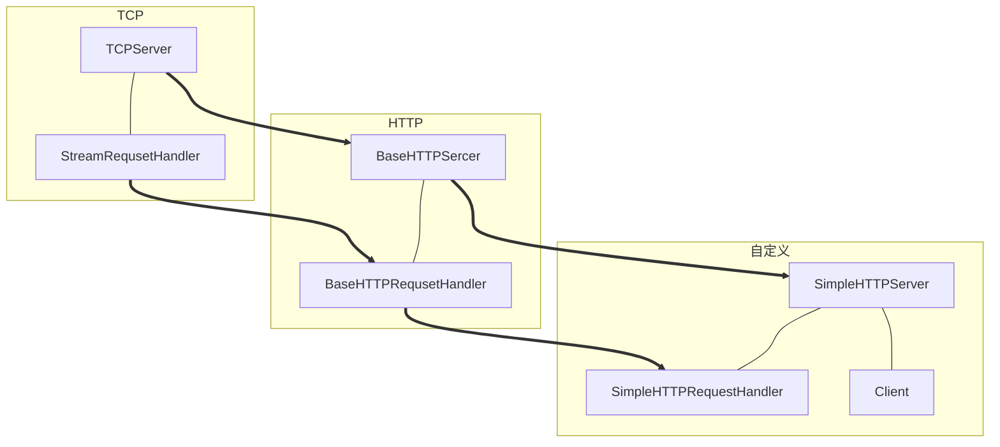

这一篇我将详细的讲述之前 http 服务器这个项目的细节、架构已经其他东西。

本项目使用的是 python 自带的 socket 包，虽然，不涉及底层代码，如三次握手、四次分手都已经给你封装好了，但是，通过这个项目的学习可以从应用层次上了解 http 服务器的运行机理。

打算，等空闲时期，可以自己实现一个 http 服务器，然后部署到线上。我一值有一个小小的计划，就是搞一些没用的代码项目，当然前提是好玩，然后，去录制一些视频，做做分享。

当然，现在只是起步的一个阶段，至于能不能完成，只能是希望吧。

<!-- more -->

 

# 路线图

 

在这里说明一下

- TCP 端
	- TCPServer ：接收客户端的 TCP 连接
	- StreamRequsetHandler ：封装字节流网络请求处理功能
- HTTP端
	- BaseHTTPSercer ：基础 HTTP 服务器
	- BaseHTTPRequsetHandler ：封装 HTTP 请求处理的基础功能
- 自定义
	- SimpleHTTPRequestHandler ：实现自定义的 HTTP 请求（GET、POST）处理逻辑

 

# 图片说明图

 

 

# 目录结构

 

- http
    - handler
        - \_\_init\_\_.py
        - base_handler.py
        - base_http_handler.py
        - simple_http_handler.py
    - resources
    	- index.html
    - server
    	- base_http_server.py
    	- simple_http_server.py
        - socket_server.py
    - test
        - test.py
    - util.py