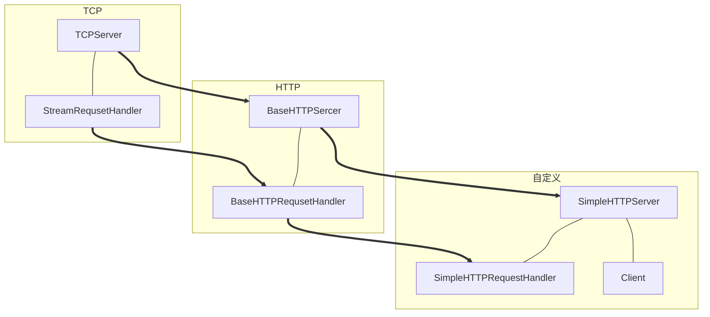

这一篇我将详细的讲述之前 http 服务器这个项目的细节、架构已经其他东西。

本项目使用的是 python 自带的 socket 包，虽然，不涉及底层代码，如三次握手、四次分手都已经给你封装好了，但是，通过这个项目的学习可以从应用层次上了解 http 服务器的运行机理。

打算，等空闲时期，可以自己实现一个 http 服务器，然后部署到线上。我一值有一个小小的计划，就是搞一些没用的代码项目，当然前提是好玩，然后，去录制一些视频，做做分享。

当然，现在只是起步的一个阶段，至于能不能完成，只能是希望吧。

<!-- more -->

 

# 路线图

 

在这里说明一下

- TCP 端
	- TCPServer ：接收客户端的 TCP 连接
	- StreamRequsetHandler ：封装字节流网络请求处理功能
- HTTP端
	- BaseHTTPSercer ：基础 HTTP 服务器
	- BaseHTTPRequsetHandler ：封装 HTTP 请求处理的基础功能
- 自定义
	- SimpleHTTPRequestHandler ：实现自定义的 HTTP 请求（GET、POST）处理逻辑

 

# 图片说明图

 

 

# 目录结构

 

- http
    - handler
        - \_\_init\_\_.py
        - base_handler.py
        - base_http_handler.py
        - simple_http_handler.py
    - resources
    	- index.html
    - server
    	- base_http_server.py
    	- simple_http_server.py
        - socket_server.py
    - test
        - test.py
    - util.py

 

# 个人分析

 

整个项目是想构建一个一个自定义的 http 服务器。这个 http 服务器其实只有两个组件。

- http 服务器运行组件
- http 服务器请求处理组件

其中，这两个组件，又在自己的垂直领域中进行了细分。

- http 服务器运行组件
    - 基础运行
    - 自定义服务器运行
- http 服务器请求处理组件
    - 基础接收/发送请求
    - 基础解析/组装请求
    - 自定义高级请求

## http 服务器运行组件

### socket_server.py

这个作为最原始的父类请求。有以下的作用

- 运行服务
- 接受和关闭请求
- 调用处理组件处理请求

## http 服务器请求处理组件

### base_handler.py

这个作为处理器的最原始的父类担当着以下作用

- 读取请求
- 发送请求
- 包装/解析请求（只是简单的进行字节和字符的相互转化）
- 请求处理（并不处理，而是由继承类处理）
- 关闭请求

这都是最原始的作用。以上均不对请求做深层次的解析，解析工作由其子类完成。

### base_http_handler.py

作为 base_handler.py 的继承类，这个主要是在解析请求上。

- 解析请求（请求行、请求头、请求内容）
- 处理请求
    - 判断请求类型
    - 根据类型调用相应的请求处理（这个类不处理，交给子类处理）
- 返回请求（请求行、请求头、请求内容）
- 404，错误请求返回

### simple_http_handler.py

这个是由用户高度自定义的请求处理。

- GET
- POST

